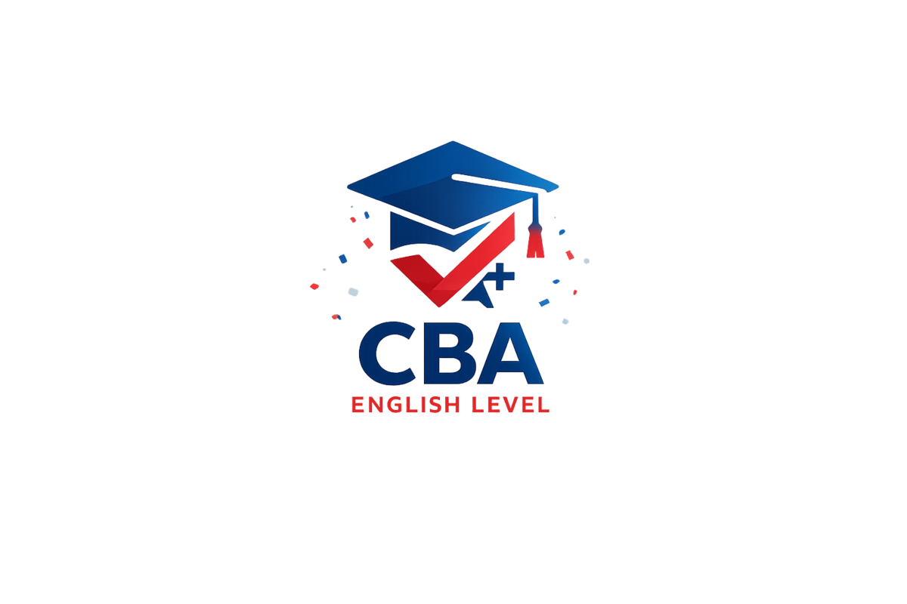
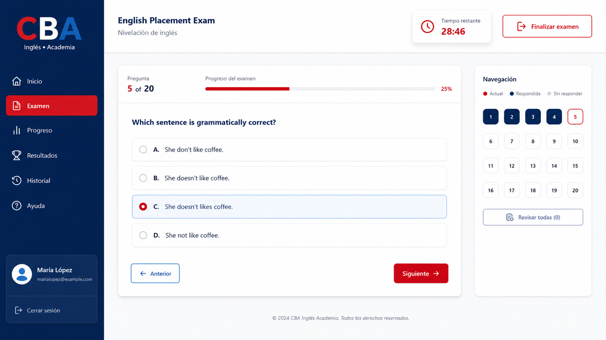
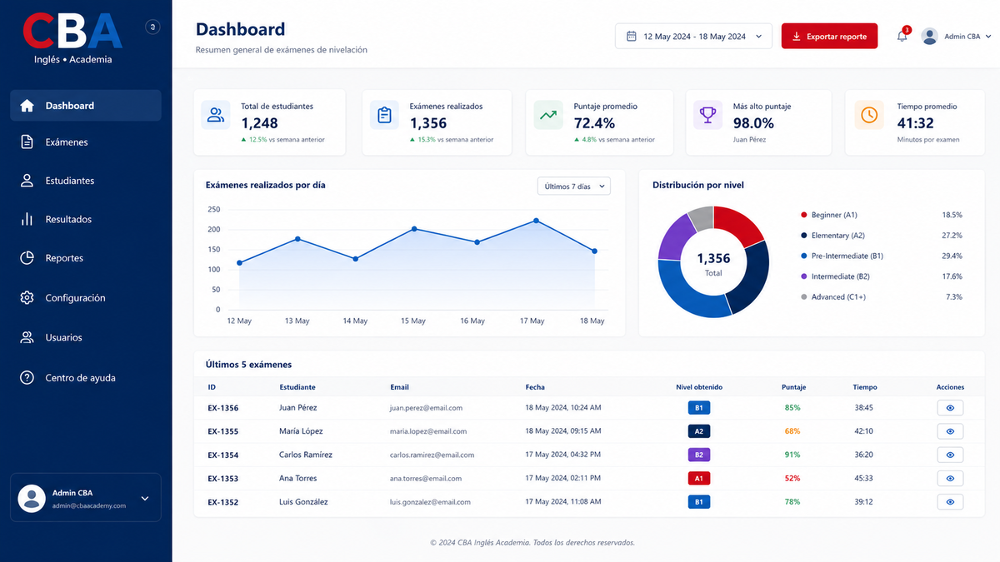
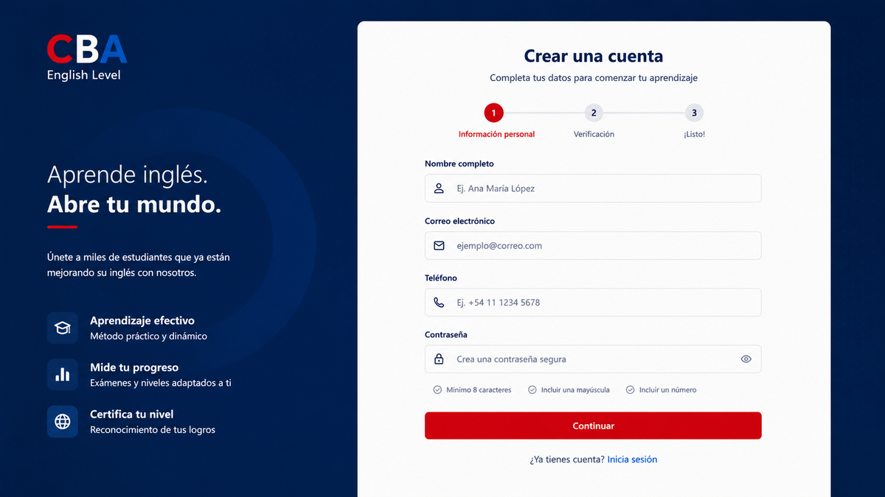
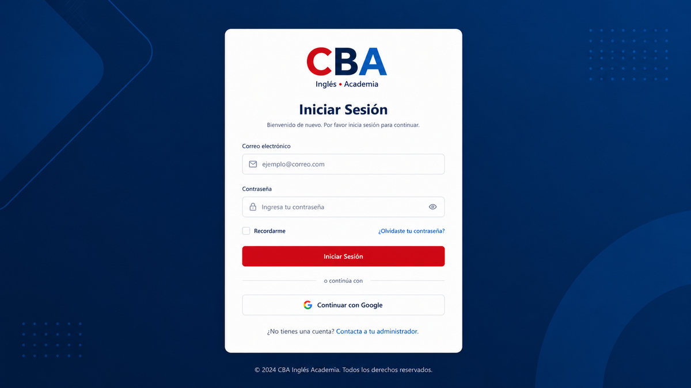
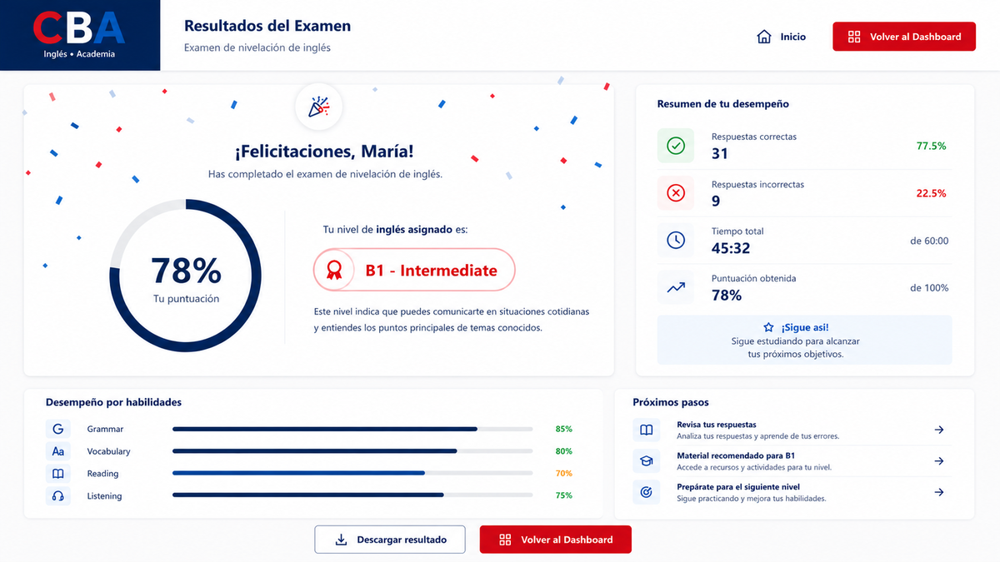

<p align="center">
  <a href="docs/assets/brand/logo.png">
    
  </a>
</p>

<h1 align="center">CBA — Sistema de Exámenes de Colocación</h1>

<div align="center">


</div>

---

<p align="center">
  <strong>Plataforma de exámenes de colocación en línea para el Centro Boliviano Americano (CBA).</strong><br>
  Determina automáticamente el nivel de inglés de nuevos estudiantes mediante exámenes temporizados.
</p>

---

📄 Leer en: [English](README.md) | **Español**

---

## Vista Previa

[](docs/assets/mockup.png)

[](docs/assets/dashboard.png)

---

## Tabla de Contenidos

- [Qué Hace](#qué-hace)
- [Funcionalidades Clave](#funcionalidades-clave)
- [Flujo de Negocio](#flujo-de-negocio)
- [Stack](#stack)
- [Arquitectura](#arquitectura)
- [Esquema de Base de Datos](#esquema-de-base-de-datos)
- [Seguridad](#seguridad)
- [Instalación](#instalación)
- [Variables de Entorno](#variables-de-entorno)
- [Deploy](#deploy)
- [Equipo](#equipo)
- [Licencia](#licencia)

---

## Qué Hace

CBA English Level es una plataforma web que moderniza todo el proceso de evaluación de ingreso — desde el registro del estudiante y el examen en línea hasta la asignación automática de nivel y la entrega de resultados.

**Antes:** Los exámenes de colocación eran en papel, se corregían manualmente y los resultados tardaban días.

**Ahora:** Los estudiantes se registran en línea, rinden un examen temporizado y reciben su nivel de inglés al instante. Los administradores gestionan preguntas, configuran exámenes y generan reportes desde un solo panel.

---

## Funcionalidades Clave

### Módulo Estudiante

- **Registro en línea** — Los estudiantes se registran con sus datos personales

[](docs/assets/registro.png)

- **Examen temporizado** — Temporizador configurable con envío automático
- **Preguntas aleatorias** — Cada examen es único, evitando memorización
- **Resultado inmediato** — Nivel asignado automáticamente al finalizar
- **Un examen por día** — Regla de negocio enforced en base de datos

### Módulo Administrador

- **Login seguro** — Autenticación via Supabase Auth

[](docs/assets/login.png)

- **Gestión de preguntas** — CRUD completo con categorías y respuestas
- **Gestión de niveles** — Rangos de puntaje no superpuestos
- **Configuración del examen** — Tiempo, cantidad de preguntas, puntaje mínimo
- **Dashboard** — Estadísticas en tiempo real
- **Reportes** — Exportación a CSV y Excel

---

## Flujo de Negocio

```
Registro del estudiante → Inicio del examen → Preguntas temporizadas
      → Envío automático (al cumplir el tiempo o al finalizar)
           → Cálculo de puntaje → Asignación de nivel
                → Resultado instantáneo
                     → Historial guardado
```

[](docs/assets/resultado.png)

---

## Stack

| Categoría | Tecnología |
|---|---|
| **UI Framework** | React 19 |
| **Lenguaje** | TypeScript 6 |
| **Estilos** | Tailwind CSS 4 |
| **Build Tool** | Vite 8 |
| **Backend / BaaS** | Supabase |
| **Base de Datos** | PostgreSQL (via Supabase) |
| **Autenticación** | Supabase Auth |
| **Deploy** | Vercel |

---

## Arquitectura

```
Cliente (React + Supabase SDK)
       ↓
Supabase (PostgreSQL + RLS + Functions + Triggers)
       ↓
       BD
```

```
src/
├── components/
│   ├── atoms/              # Componentes base
│   ├── molecules/          # Componentes compuestos
│   ├── organisms/          # Features completas
│   └── screens/            # Páginas enteras
├── hooks/                  # Custom hooks
├── lib/                    # Cliente Supabase
├── services/               # Lógica de negocio
├── types/                  # Interfaces TypeScript
└── utils/                  # Funciones auxiliares
```

### Distribución de Lógica de Negocio

| Regla | Implementación |
|---|---|
| Control de acceso | Row Level Security (RLS) |
| Reglas críticas (no editar históricos) | Triggers SQL |
| Cálculo de puntaje / nivel | Funciones SQL |
| Validaciones de integridad | Constraints + Funciones SQL |
| Temporizador, UI | React (frontend) |
| Reportes CSV / Excel | Librerías en frontend |

---

## Esquema de Base de Datos

Base de datos en **Supabase (PostgreSQL)** con RLS habilitado en todas las tablas.

Entidades principales:

- **students** — Estudiantes registrados
- **admins** — Administradores del sistema
- **levels** — Niveles de inglés con rangos de puntaje
- **questions** — Preguntas con opciones y respuesta correcta
- **exams** — Sesiones de examen vinculadas a estudiantes
- **exam_config** — Configuración global del examen

---

## Seguridad

- **Row Level Security (RLS)** habilitado en todas las tablas
- **Supabase Auth** para autenticación con sesiones JWT
- **Route guards** en todas las páginas privadas
- **Validación backend** via constraints y triggers SQL
- **Protección XSS** mediante sanitización de entrada
- **SQL Injection** prevenido por consultas parametrizadas de Supabase

---

## Instalación

### Prerrequisitos

- Node.js 18+ y npm
- Una cuenta en [Supabase](https://supabase.com) (plan gratis funciona)
- Git

### 1. Clonar el repositorio

```bash
git clone https://github.com/AFB-9898/CBA-English-Level.git
cd CBA-English-Level
```

### 2. Instalar dependencias

```bash
npm install
```

### 3. Configurar variables de entorno

Crear un archivo `.env.local`:

```env
VITE_SUPABASE_URL=https://your-project.supabase.co
VITE_SUPABASE_ANON_KEY=your-anon-key-here
```

### 4. Configurar la base de datos

`supabase/migrations/` es la única autoridad de migraciones del proyecto.
Desde la raíz del repositorio, usá Supabase CLI para aplicar el conjunto
completo en orden:

```bash
supabase db reset --local  # desarrollo local
# supabase db push         # proyecto remoto vinculado
```

No ejecutes scripts de migración desde `database/`; ese directorio contiene
únicamente documentación y recursos de diseño de la base de datos.

### 5. Ejecutar localmente

```bash
npm run dev
# Abre en http://localhost:5173
```

### 6. Build para producción

```bash
npm run build    # Genera dist/
npm run preview  # Vista previa del build
```

---

## Variables de Entorno

| Variable | Descripción |
|---|---|
| `VITE_SUPABASE_URL` | URL del proyecto Supabase |
| `VITE_SUPABASE_ANON_KEY` | API key anónima de Supabase |

---

## Deploy

El proyecto se deploya en **Vercel** con esta configuración:

```json
{
  "rewrites": [{ "source": "/(.*)", "destination": "/index.html" }],
  "buildCommand": "npm run build",
  "outputDirectory": "dist",
  "framework": "vite"
}
```

Para deployar tu propia instancia:

1. Subí el repo a GitHub
2. Importá el proyecto en [vercel.com](https://vercel.com)
3. Agregá las variables `VITE_SUPABASE_URL` y `VITE_SUPABASE_ANON_KEY`
4. Deployá

---

## Equipo

| Miembro | Rol | Responsabilidades |
|---|---|---|
| Abraham Flores Barrionuevo | Frontend Developer + Supabase Backend | Arquitectura de la aplicación, sistema Atomic Design, configuración de Supabase (Auth, RLS policies, Storage), diseño de base de datos, lógica de examen, reportes |

- Abraham Flores Barrionuevo — [@AFB-9898](https://github.com/AFB-9898)

---

[](LICENSE)

