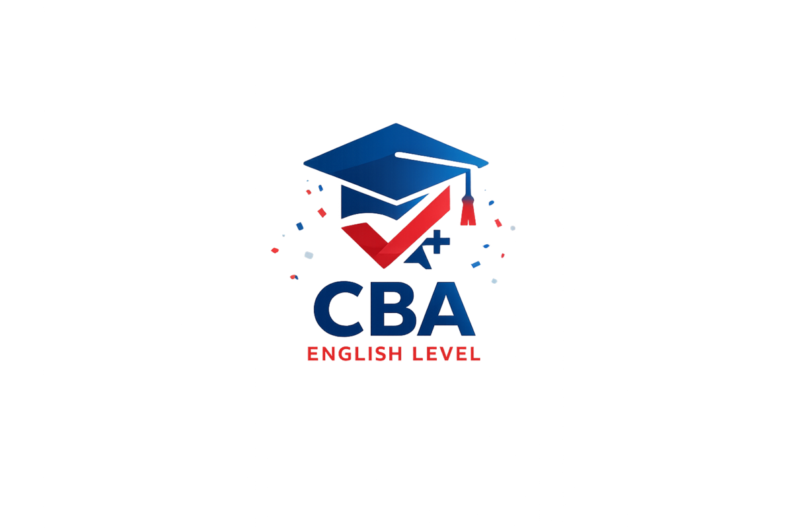
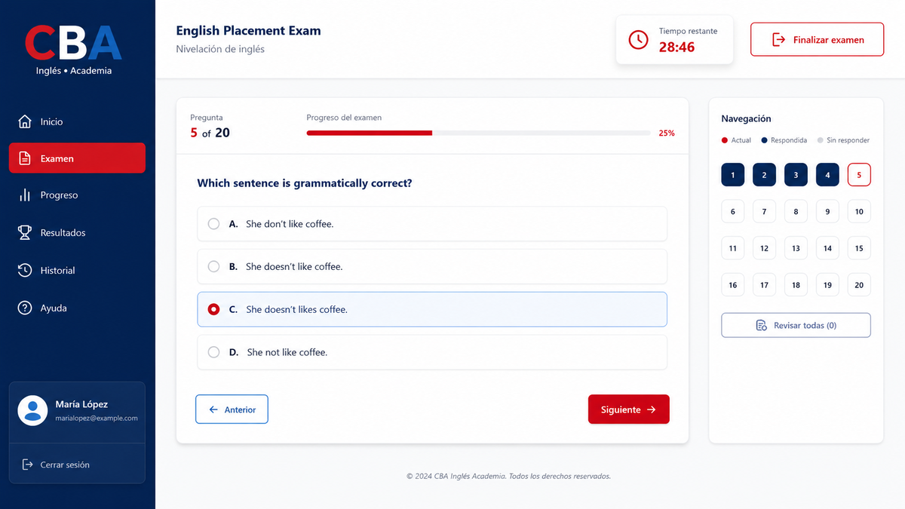
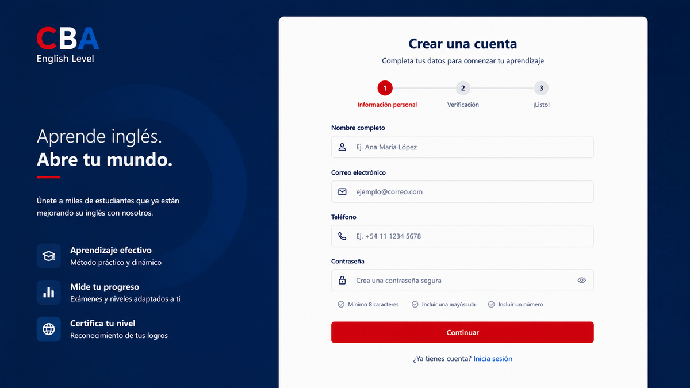
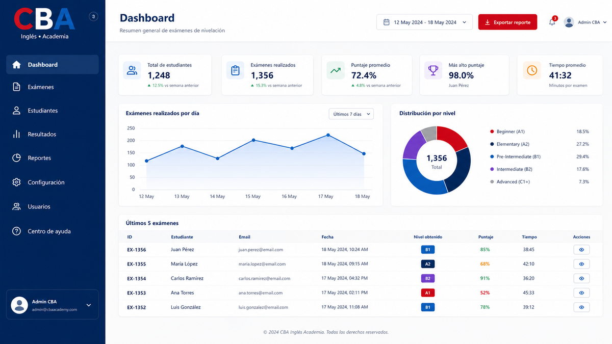
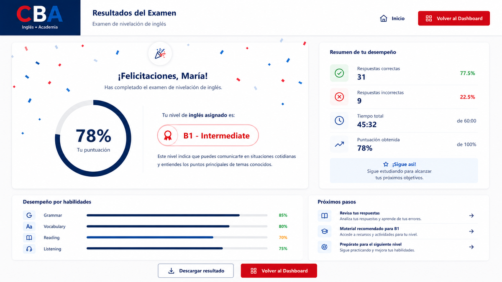
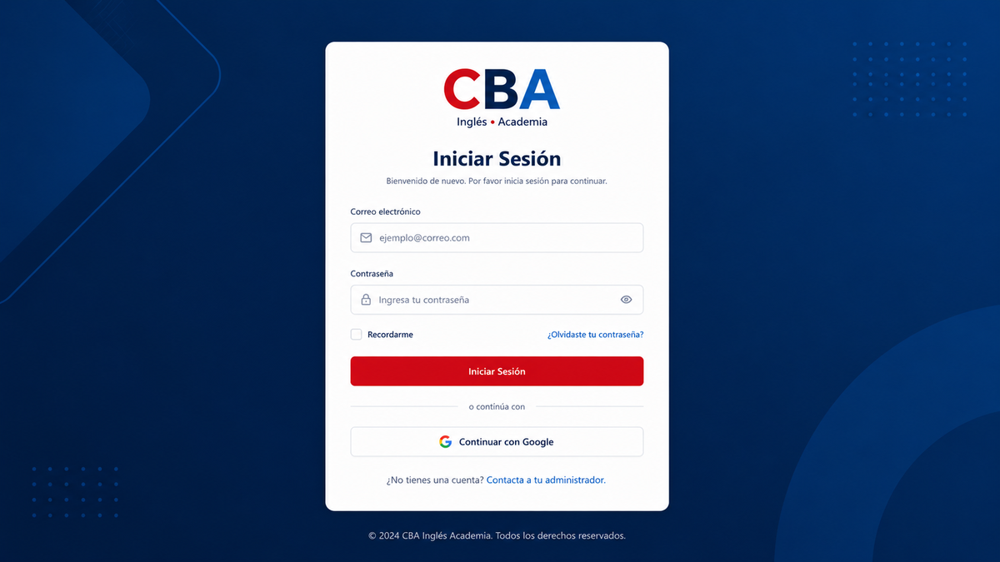

<p align="center">
  
</p>

<h1 align="center">CBA English Level</h1>

<p align="center">
  <a href="README.md">English</a> | <a href="README.es.md">Español</a>
</p>

<p align="center">
  <a href="https://react.dev/"></a>
  <a href="https://www.typescriptlang.org/"></a>
  <a href="https://vite.dev/"></a>
  <a href="https://supabase.com/"></a>
  <a href="https://vercel.com/"></a>
</p>

> Web application for assessing new students' English level through configurable exams, immediate results, and verifiable history.

## Preview

<p align="center">
  
</p>

| Registration and sign-in | Administration dashboard |
|---|---|
|  |  |

| Exam result | System access |
|---|---|
|  |  |

## Contents

- [Quick start](#quick-start)
- [Implemented features](#implemented-features)
- [Main routes](#main-routes)
- [Architecture](#architecture)
- [Local setup](#local-setup)
- [Known operational limitations](#known-operational-limitations)
- [Final documentation](#final-documentation)
- [Author](#author)

## Quick start

1. Install Node.js and npm, Docker, and the Supabase CLI.
2. Install dependencies with `npm install`.
3. Run `npm run dev:local` and open `http://localhost:5173`.

The application does not configure these variables automatically: `.env.local` remains required after `supabase start` and for any remote project. The application fails at startup if either `VITE_*` variable is missing; no credentials are included in the repository.

## Implemented features

| Area | Current capabilities |
|---|---|
| Student | Email/password registration, sign-in, status panel, start or resume attempt, server-time-based timer, answer saving, submission, result, and completed-attempt history. |
| Administration | Dashboard, student profile lookup and limited editing, question bank, versioned CEFR levels, exam configuration, CSV/XLSX reports, and audit log. |
| Exam | Random selection of valid questions, immutable configuration, question, option, and level snapshots, percentage calculation, and CEFR assignment. |
| Security | Supabase Auth, role-protected routes, RLS, and role-checking RPC; the student flow does not expose correct answers. |

## Main routes

| Route | Access | Purpose |
|---|---|---|
| `/register` | Public | Student registration. |
| `/login` | Public | Student or administrator sign-in. |
| `/student` | Student | Exam status, latest result, and start/resume. |
| `/student/exam/:attemptId` | Owner student | Exam and attempt result. |
| `/student/history` | Owner student | Completed-attempt history. |
| `/admin` | Administrator | Dashboard. |
| `/admin/students` | Administrator | Student search, profile, and results. |
| `/admin/questions` | Administrator | Question bank. |
| `/admin/levels` | Administrator | CEFR levels and score distribution. |
| `/admin/exam-configuration` | Administrator | Exam configuration for future attempts. |
| `/admin/reports` | Administrator | Reports and export. |
| `/admin/audit-log` | Administrator | Audit timeline. |

## Architecture

```text
React 19 + TypeScript + Vite + Tailwind CSS
                 |
          Supabase JavaScript SDK
                 |
Supabase Auth + PostgreSQL + RLS + RPC + triggers
```

The frontend organizes components into `atoms`, `molecules`, and `organisms`, pages in `src/pages`, access hooks in `src/hooks`, and the Supabase client in `src/lib/supabase.ts`. The interface is localized in Spanish and English; the visual identity uses CBA styles for authentication, student, and administration experiences.

The source of truth for the schema is `supabase/migrations/`, in numeric order. `database/` contains documentation and diagrams, not scripts to apply manually.

## Local setup

The official command for local development is `npm run dev:local`. It starts Supabase, resets only the local database with all migrations and fixtures, and opens Vite at `http://localhost:5173`. The reset removes previous local data; never run this command against a remote project.

Example `.env.local`:

```env
VITE_SUPABASE_URL=http://127.0.0.1:54321
VITE_SUPABASE_ANON_KEY=<local-publishable-key-from-supabase-status>
```

Create `.env.local` with the public values returned by `supabase status -o env`; secret keys are neither documented nor versioned. `supabase/seed.sql` creates only synthetic administrator and student fixtures when `supabase db reset --local` runs.

Available commands: `npm run dev:local`, `npm run dev`, `npm run build`, `npm run preview`, `npm run lint`, and `npm test`. The local Supabase configuration exposes the API on port `54321`, the database on `54322`, and Studio on `54323`.

## Known operational limitations

- The configuration requires enough valid questions: every selectable question must have at least two options and exactly one correct option.
- The configured maximum number of questions is not validated when the configuration is saved; the attempt is rejected when starting if the question bank does not reach that number.
- `passing_score` is stored and versioned, but the current cycle only persists percentage and CEFR level: no pass/fail result is stored or displayed.
- Reports export a maximum of 5,000 rows per filtered query.
- The documented backup recovery is only for a local Supabase stack; it does not automate a remote or production restoration.

## Final documentation

- [Technical manual](docs/manual-tecnico.md)
- [User manual](docs/manual-usuario.md)
- [Entity-relationship model](database/diagrama-uml.puml)
- [Relational model](database/modelo-relacional.md)
- [Data dictionary](database/data-dictionary.md)
- [Backup procedure](docs/daily-backups.md)

## Author

**Abraham Flores Barrionuevo** - Full-Stack Developer

- GitHub: [@AFB-9898](https://github.com/AFB-9898)
- Academic project developed for Centro Boliviano Americano (CBA), Tarija.
