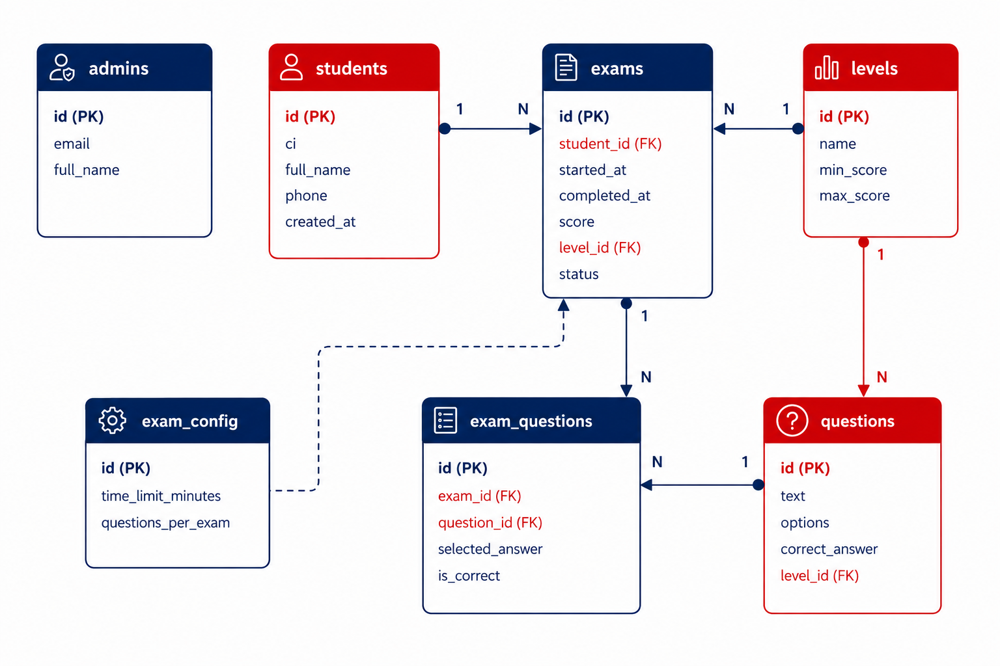
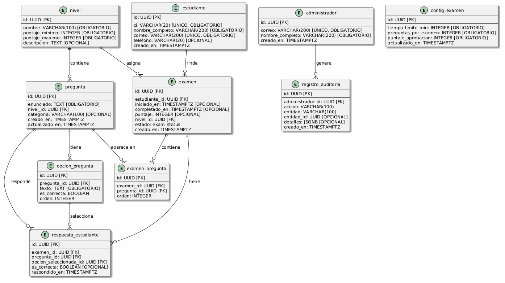
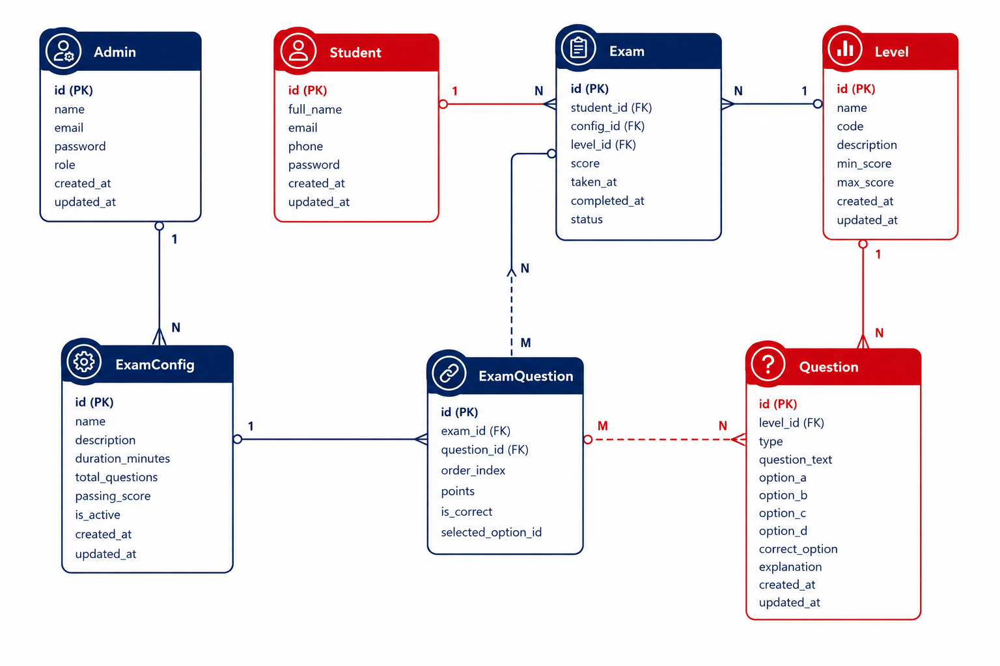

# Base de Datos — CBA English Level

> Diseño de base de datos del **Sistema de Exámenes de Colocación** del **Centro Boliviano Americano (CBA)**.
>
> 10 tablas en **3ra Forma Normal**, con RLS policies, triggers de protección de históricos, funciones SQL para cálculo de nivel, y auditoría administrativa.

---

## ¿Qué hay acá?

| Archivo | Descripción |
|---|---|
| [`../supabase/migrations/`](../supabase/migrations/) | Fuente única y oficial de migraciones versionadas de esquema, datos, funciones, triggers y RLS |
| [`data-dictionary.md`](./data-dictionary.md) | Diccionario de datos con todas las tablas, columnas y restricciones |
| [`diagrama-uml.puml`](./diagrama-uml.puml) | Código fuente PlantUML del diagrama entidad-relación |
| [`diagrama-conceptual.png`](./diagrama-conceptual.png) | Diagrama conceptual (vista de alto nivel del negocio) |
| [`diagrama-relacional.png`](./diagrama-relacional.png) | Modelo relacional completo con claves y relaciones |
| [`Diagrama-UML-10-Tablas.png`](./Diagrama-UML-10-Tablas.png) | Diagrama UML generado desde PlantUML |
| [`Imagen-10-Tablas.png`](./Imagen-10-Tablas.png) | Esquema visual generado por IA |

---

## Diagramas

### Modelo Relacional



### Diagrama UML



### Diagrama Conceptual



---

## Tablas (resumen)

| Tabla | Propósito |
|---|---|
| `student` | Registro de estudiantes (CI, email, nombre) |
| `admin` | Administradores del sistema |
| `level` | Niveles de inglés con rangos de puntaje (MCERL) |
| `exam_config` | Configuración global del examen (singleton) |
| `question` | Banco de preguntas clasificadas por nivel y categoría |
| `question_option` | Opciones de respuesta (una correcta por pregunta) |
| `exam` | Examen rendido por un estudiante |
| `exam_question` | Preguntas específicas asignadas a un examen |
| `student_answer` | Respuestas individuales del estudiante |
| `audit_log` | Auditoría de acciones administrativas |

---

## Reglas de negocio (a nivel BD)

| Regla | Implementación |
|---|---|
| Un estudiante solo puede rendir **un examen por día** | Trigger `trg_check_daily_exam` en `INSERT` a `exam` |
| Los **resultados históricos nunca se modifican** | Trigger `trg_prevent_historical_change` en `UPDATE` a `student_answer` |
| El nivel se calcula automáticamente | Función `fn_complete_exam()` |
| Las preguntas se asignan aleatoriamente | Función `fn_get_random_questions()` |
| Las opciones tienen orden definido | `CHECK("order" >= 0)` + `UNIQUE(question_id, order)` |
| Auditoría de acciones administrativas | Tabla `audit_log` + trigger base `fn_audit_admin_action` |
| Acceso por fila (RLS) | Políticas por rol: estudiante ve solo lo suyo, admin ve todo |

---

## Cómo usar

### Opción 1: Supabase CLI (recomendado)

Desde la raíz del proyecto, ejecutá el reset local para aplicar exclusivamente
las migraciones oficiales de `supabase/migrations/`:

```bash
supabase db reset --local
```

Para un proyecto remoto, aplicá las migraciones mediante el flujo oficial de
Supabase CLI (`supabase db push`). No ejecutes scripts SQL desde este directorio.

### Opción 2: Supabase SQL Editor

Si necesitás ejecutar SQL manualmente, usá únicamente los archivos versionados
de `supabase/migrations/`, respetando su orden numérico.

### Autoridad y orden de migración

`supabase/migrations/` es la única autoridad de migraciones del proyecto. El
Supabase CLI aplica sus archivos versionados en orden numérico; `database/` solo
contiene documentación, diagramas y el diccionario de datos.

---

## Stack

| Componente | Tecnología |
|---|---|
| Motor de BD | PostgreSQL 15+ (vía Supabase) |
| Autenticación | Supabase Auth (email/CI + contraseña) |
| Autorización | Row Level Security (RLS) |
| Lenguaje de funciones | PL/pgSQL |
| Diagramas | PlantUML + AI-generated |

---

## Convenciones

- Nombres de tablas en **singular**
- Nombres de columnas en **snake_case**
- Clave primaria: `id` (UUID)
- Claves foráneas: `tabla_id` (ej: `student_id`, `level_id`)
- `TIMESTAMPTZ` para campos de fecha/hora
